# Teaching Perceptions Unveiled: Analyzing Gender Bias and Predictors in Professor Ratings

## Project Overview
This project investigates gender bias in professor ratings and identifies key predictors of teaching effectiveness using data from RateMyProfessor.com (RMP). I analyzed disparities in ratings, examined descriptive tags, and built predictive models to uncover patterns in evaluations. The findings aim to improve fairness in academia and provide actionable insights for educators and institutions.

---

## Data Collection
The dataset was created using the following steps:
1. **Web Scraping**:
   - Scraped professor profiles, ratings, tags, and institutional data from RMP using Python libraries like BeautifulSoup and Selenium.
2. **Data Collation**:
   - Aggregated individual ratings into average scores (e.g., quality, difficulty) and cleaned duplicates.
3. **Anonymization**:
   - Removed identifying information such as professor names to preserve privacy.
4. **Validation**:
   - Cross-checked with a manually collected sample, achieving a 98% match rate for accuracy.

---

## Dataset Description
This project uses three datasets, each containing 89,893 records corresponding to individual professors:

### **1. Numerical Data (`rmpCapstoneNum.csv`)**
Each row corresponds to a professor and includes the following columns:
1. **Average Rating**: The arithmetic mean of all individual quality ratings.
2. **Average Difficulty**: The arithmetic mean of all individual difficulty ratings.
3. **Number of Ratings**: The total number of ratings the professor received.
4. **Received a “Pepper”?**: Boolean (1 = Yes, 0 = No) indicating if the professor was rated "hot."
5. **Proportion Retake**: Percentage of students who would take the professor's class again.
6. **Online Ratings**: The number of ratings from online classes.
7. **Male Gender**: Boolean (1 = Professor identified as male with high confidence).
8. **Female Gender**: Boolean (1 = Professor identified as female with high confidence).

### **2. Qualitative Data (`rmpCapstoneQual.csv`)**
Each row corresponds to a professor and includes qualitative information:
1. **Major/Field**: The professor's area of expertise.
2. **University**: The name of the institution.
3. **US State**: Two-letter abbreviation of the institution's state.

### **3. Tags Data (`rmpCapstoneTags.csv`)**
Each row corresponds to a professor and contains 20 columns representing raw tag counts. Students can assign up to three tags to a professor per rating to describe their teaching style qualitatively:
1. **Tough Grader**
2. **Good Feedback**
3. **Respected**
4. **Lots to Read**
5. **Participation Matters**
6. **Don’t Skip Class or You Will Not Pass**
7. **Lots of Homework**
8. **Inspirational**
9. **Pop Quizzes!**
10. **Accessible**
11. **So Many Papers**
12. **Clear Grading**
13. **Hilarious**
14. **Test Heavy**
15. **Graded by Few Things**
16. **Amazing Lectures**
17. **Caring**
18. **Extra Credit**
19. **Group Projects**
20. **Lecture Heavy**

## Preprocessing Challenges and Solutions

### Challenges Encountered
1. **Missing Data**:
   - Several records were incomplete, with missing values for critical fields like average ratings and difficulty levels.
   - **Problem**: Missing values reduce the dataset’s analytical integrity and may lead to biased conclusions.

2. **Extreme Ratings**:
   - Some professors had ratings based on only one or two students, leading to extreme averages of 1 or 5.
   - **Problem**: Such low-sample averages are unreliable and can skew statistical analysis.

3. **False Positives in Statistical Analysis**:
   - The large dataset provided sufficient statistical power, increasing the risk of false positives when conducting multiple hypothesis tests.
   - **Problem**: Without proper corrections, spurious results could compromise the validity of findings.

4. **Raw Tag Counts**:
   - Tags like "Tough Grader" were recorded as raw counts, biased by the number of ratings a professor received.
   - **Problem**: Professors with more ratings appeared to have higher tag counts, distorting meaningful comparisons.

5. **Ambiguous Gender Entries**:
   - Some records had unclear or conflicting gender classifications.
   - **Problem**: This ambiguity could mislead gender-based analyses, reducing credibility.

---

### How Challenges Were Addressed

1. **Handling Missing Data**:
   - **Do**: Rows with missing average ratings or difficulty values were dropped to ensure data integrity.
   - **Why**: Excluding incomplete records guarantees that analyses rely on complete and valid information.
   - **Find**: This step reduced noise in the dataset, allowing for more reliable statistical results.

2. **Filtering Extreme Ratings**:
   - **Do**: Professors with fewer than five ratings were excluded.
   - **Why**: A minimum threshold prevents skewed averages caused by a small number of ratings, fostering more stable insights.
   - **Find**: After filtering, the average rating distribution remained centered around ~3.5, reflecting typical evaluations.

3. **Mitigating False Positives**:
   - **Do**: Applied a stricter significance threshold (\( \alpha = 0.005 \)) for all statistical tests and employed Bonferroni correction for multiple comparisons.
   - **Why**: These adjustments reduce the likelihood of false positives, ensuring robust and credible findings.
   - **Find**: The adjusted threshold identified significant patterns while avoiding overinterpretation.

4. **Normalizing Tags**:
   - **Do**: Converted raw tag counts to proportions (tag count ÷ total ratings).
   - **Why**: Normalizing tags ensures fair comparisons, regardless of the number of ratings a professor received.
   - **Find**: This step revealed meaningful differences in tag usage across genders, with certain characteristics like "Tough Grader" appearing more frequently.

5. **Resolving Ambiguous Gender Entries**:
   - **Do**: Created binary columns (`gender00`, `gender11`) and assigned ambiguous cases a value of 0 for both Male and Female.
   - **Why**: Explicitly handling ambiguous entries prevents misclassification and strengthens gender-based analyses.
   - **Find**: Gender data became cleaner and more interpretable, supporting accurate statistical tests.

6. **Seeding the Random Number Generator**:
   - **Do**: Seeded the RNG with a team member's unique identifier (N-number).
   - **Why**: Ensures reproducibility of results, allowing consistent splits in train-test datasets and bootstrapping processes.
   - **Find**: Reproducibility helped maintain computational integrity throughout the project.

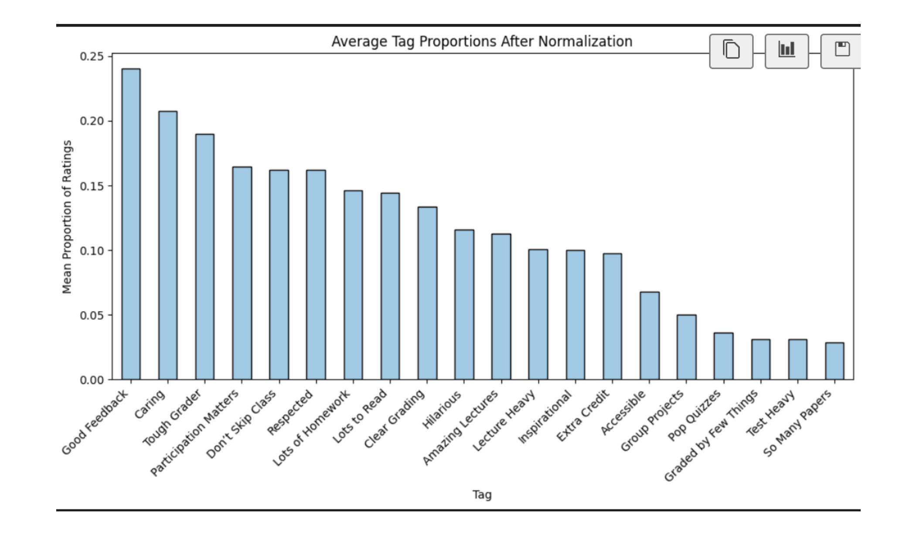
---

### Impact of Preprocessing
The preprocessing steps transformed the raw dataset into a robust and reliable foundation for analysis:
- Ratings became stable and representative, reducing noise from low-sample extremes.
- Normalized tag frequencies enabled meaningful teaching style comparisons.
- Cleaned gender data ensured accurate evaluations, free from ambiguities.
- Proper statistical corrections bolstered the credibility of findings.

By addressing these challenges, the dataset allowed for confident identification of patterns, biases, and predictors in professor evaluations.

## Preprocessing
### In Short Steps and Rationale
- **Outlier Removal**: 
  - Filtered professors with fewer than 5 ratings to prevent skewed averages.
- **Handling Missing Data**:
  - Used mean imputation for numerical features and excluded rows missing critical data.
- **Tag Normalization**:
  - Converted raw tag counts to proportions to ensure fair comparisons.
- **Gender Classification**:
  - Created binary columns to handle ambiguous gender entries.
- **Feature Scaling**:
  - Standardized numerical features for consistent model performance.

---

## Objectives

With this dataset in hand, the project aims to answer the following questions:

1. **Gender Bias in Ratings**:
   - Activists have asserted that there is a strong gender bias in student evaluations of professors, with male professors enjoying a boost in ratings. However, skeptics have criticized the quality of such research, citing small sample sizes, failure to control for confounders, and potential p-hacking. This project examines whether there is evidence of a pro-male gender bias in the dataset.
   - *Hint*: A significance test is probably required.

2. **Variance in Ratings**:
   - Is there a gender difference in the spread (variance/dispersion) of the ratings distribution? Statistical significance of observed differences in variance will be evaluated.

3. **Effect Size Estimation**:
   - What is the likely size of both of these effects (gender bias in average rating, gender bias in spread of average rating)? This will be estimated using a 95% confidence interval.

4. **Gender Differences in Tags**:
   - Are there gender differences in the tags awarded by students? Each of the 20 tags will be tested for potential gender differences, identifying the most and least gendered tags based on statistical significance (lowest and highest p-values, respectively).

5. **Gender Differences in Difficulty Ratings**:
   - Is there a gender difference in terms of average difficulty? Statistical testing will be used to determine significance.

6. **Quantifying Effect Size in Difficulty**:
   - What is the likely size of the gender difference in difficulty ratings at a 95% confidence level?

7. **Predicting Average Ratings**:
   - Build a regression model to predict average ratings using all numerical predictors from the `rmpCapstoneNum.csv` file. The model should include metrics such as \( R^2 \) and RMSE, and address collinearity concerns to identify the most significant predictors.

8. **Predicting Ratings Using Tags**:
   - Build a regression model to predict average ratings using all tags from the `rmpCapstoneTags.csv` file. Compare this model's performance (e.g., \( R^2 \), RMSE) with the numerical model and identify which tags are most strongly predictive of ratings.

9. **Predicting Difficulty Using Tags**:
   - Build a regression model to predict average difficulty using all tags from the `rmpCapstoneTags.csv` file. Include metrics like \( R^2 \) and RMSE, and identify the most significant predictors while addressing collinearity.

10. **Predicting Pepper Badges**:
    - Build a classification model to predict whether a professor receives a "pepper" badge using all available factors (tags and numerical). Evaluate model quality with metrics such as AU(RO)C and address class imbalance concerns.

## Findings and Answers to Objectives

### 1: Evidence of Gender Bias in Ratings
- **p-value**: 0.00049
- **Median Rating (Male)**: 4.2  
- **Median Rating (Female)**: 4.1  
- **Significance**: The Mann-Whitney U test indicates a statistically significant difference (p < 0.005). Male professors have slightly higher ratings, but the effect is small.
- **Conclusion**: There is a subtle pro-male bias in ratings, but its practical significance is limited.

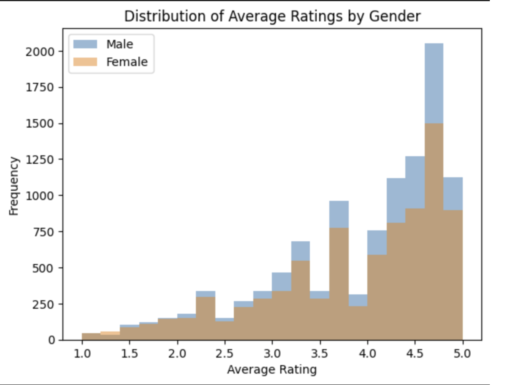
---

### 2: Variance in Ratings
- **Levene’s Test Results**:
  - **Variance (Male)**: 0.824  
  - **Variance (Female)**: 0.902  
  - **p-value**: 5.97e-06  
- **Significance**: Female professors exhibit significantly higher rating variance than male professors (p < 0.005).
- **Conclusion**: Female professors' ratings show greater dispersion, indicating polarized perceptions of their performance.

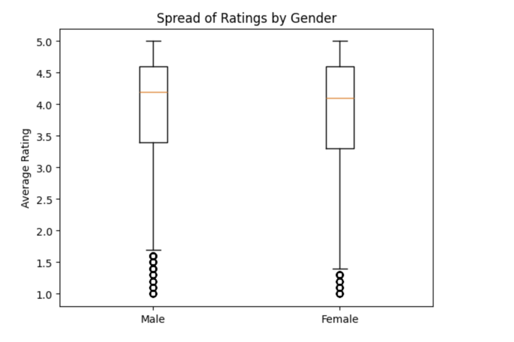

---

### 3: Effect Size of Gender Bias
- **Mean Difference**: 0.059 (Male > Female)
- **95% Confidence Interval**: [0.032, 0.086]  
- **Cohen’s d**: 0.063  
- **Significance**: The difference is statistically significant, but the effect size is very small.
- **Conclusion**: Male professors receive slightly higher ratings, but the difference is negligible in practical terms.

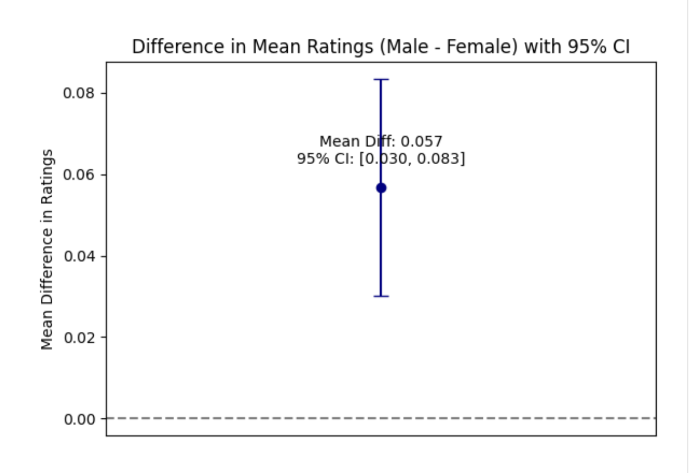

---

### 4: Gender Differences in Tags
- **Most Gendered Tags**:
  - "Hilarious" (p ≈ 4.42e-153)
  - "Amazing Lectures" (p ≈ 7.31e-42)
  - "Caring" (p ≈ 3.31e-36)  
- **Least Gendered Tags**:
  - "Test Heavy" (p ≈ 2.80e-04)
  - "Accessible" (p ≈ 4.27e-03)  
- **Conclusion**: Only "Hilarious," "Amazing Lectures," and "Caring" remained significant after Bonferroni correction, highlighting robust gender differences in these tags.

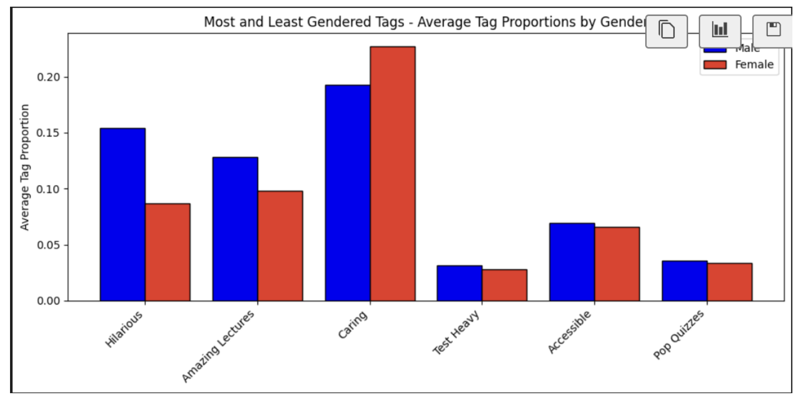

---

### Q5: Gender Differences in Difficulty Ratings
- **Mean Difficulty**:
  - Male: ≈ 2.9021  
  - Female: ≈ 2.9012  
- **Significance**: Welch’s t-test shows no significant difference (p ≈ 0.9432).
- **Conclusion**: There is no meaningful gender-based difference in perceived difficulty.

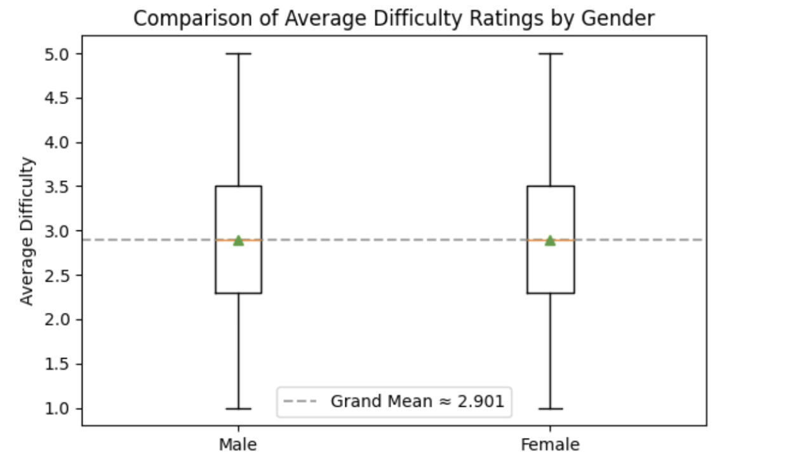

---

### Q6: Effect Size of Difficulty Ratings
- **Mean Difference**: 0.00085 (Male > Female)
- **95% Confidence Interval**: [-0.0225, 0.0242]  
- **Cohen’s d**: ≈ 0.00105  
- **Conclusion**: The effect size is negligible, with no statistically or practically significant gender difference in difficulty ratings.

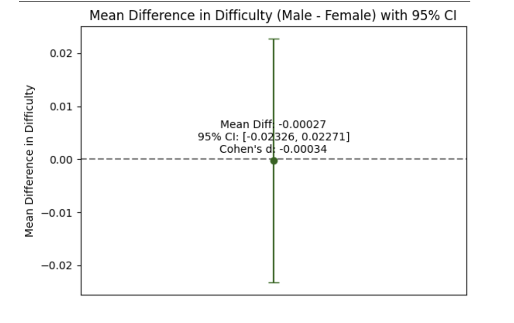

---

### 7: Predicting Average Ratings (Numerical Predictors)
- **Model Performance**:
  - \( R^2 \): 0.4769  
  - RMSE: ≈ 0.684  
- **Most Influential Predictor**: AvgDifficulty (negative correlation with AvgRating).
- **Conclusion**: Higher difficulty ratings reduce average ratings. The model effectively explains 47.69% of variance in AvgRating.

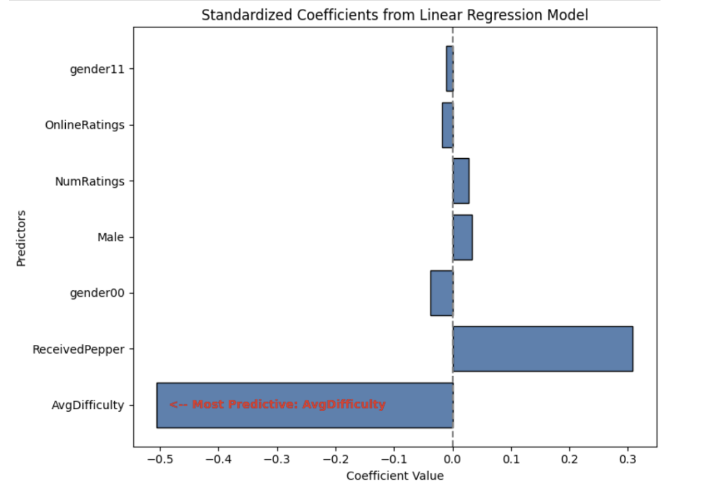

---

### 8: Predicting Average Ratings (Tag-Based Predictors)
- **Model Performance**:
  - \( R^2 \): ≈ 0.7186  
  - RMSE: ≈ 0.5018  
- **Most Influential Predictor**: "Tough Grader" (negative correlation with AvgRating).
- **Conclusion**: Tags provide richer insights than numerical predictors, explaining 71.86% of variance in AvgRating.

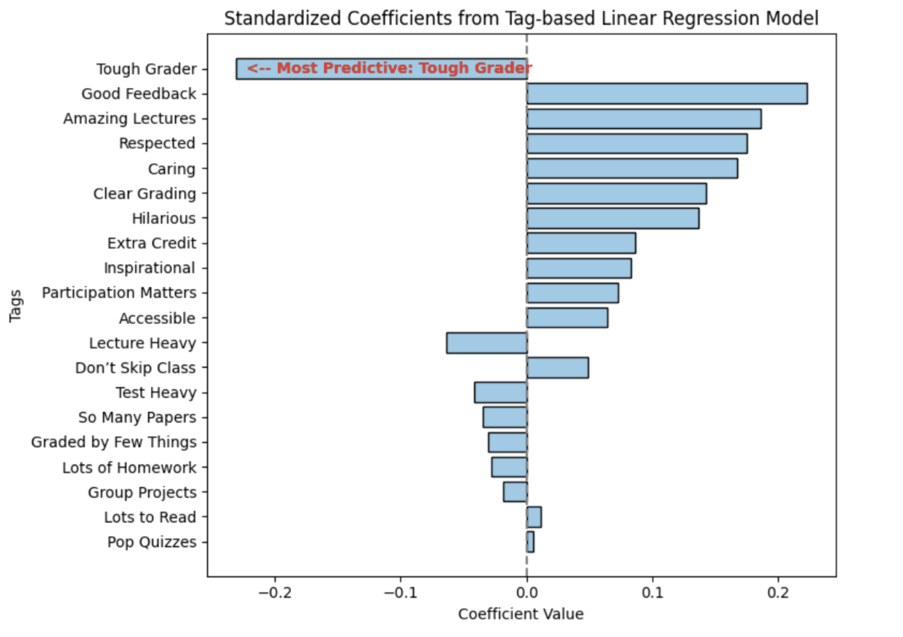

---

### 9: Predicting Difficulty (Tag-Based Predictors)
- **Model Performance**:
  - \( R^2 \): ≈ 0.5407  
  - RMSE: ≈ 0.5426  
- **Most Influential Predictor**: "Tough Grader" (positive correlation with AvgDifficulty).
- **Conclusion**: Tags explain 54.07% of variance in AvgDifficulty, with "Tough Grader" strongly influencing perceptions of difficulty.

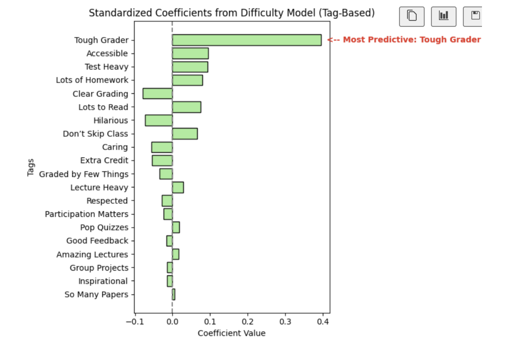

---

### 10: Predicting Pepper Badges
- **Model Performance**:
  - AUROC: ≈ 0.7775  
  - Accuracy: ≈ 71%  
- **Influential Predictors**:
  - "Amazing Lectures" (positive effect)
  - "Good Feedback" (positive effect)  
- **Conclusion**: Logistic Regression effectively predicts pepper badges, revealing the importance of lecture quality and feedback in influencing this outcome.

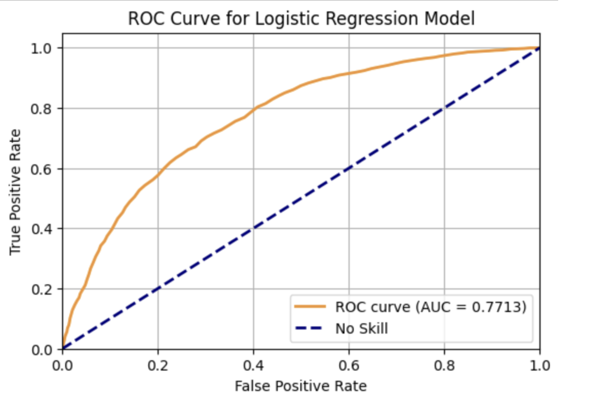

---

### 11: Insights from Qualitative Data 
- **Findings**:
  - Aerospace Engineering: High AvgDifficulty (≈ 5.0), Low AvgRating (≈ 1.8).
  - Office Technology: High AvgRating (≈ 5.0), Low AvgDifficulty.
- **Conclusion**: Contextual attributes like academic discipline significantly shape student perceptions, emphasizing the importance of qualitative data for deeper insights.

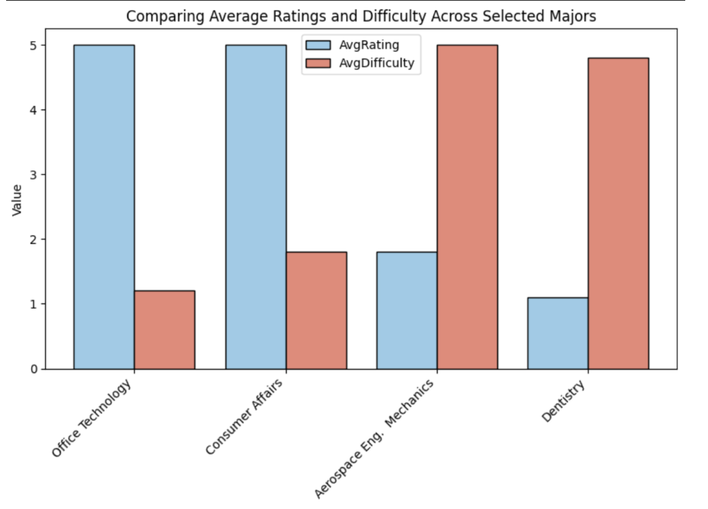

These objectives guide the project to comprehensively analyze gender bias, predictive factors, and other insights from the dataset, ensuring statistically robust results and actionable findings.
---

## Methods
### Statistical Analysis
- Mann-Whitney U Test, Welch’s T-Test, and Levene’s Test were used to compare distributions, means, and variances.
- Confidence intervals (95%) calculated for rating effects.

### Regression Models
1. **Numerical Predictors**:
   - \( R^2 = 0.48 \), RMSE = 0.68.
   - Difficulty ratings negatively correlated with average ratings.
2. **Tag Predictors**:
   - \( R^2 = 0.72 \), RMSE = 0.50.
   - "Tough Grader" strongly influenced ratings negatively.

### Classification Model
- Logistic regression with SMOTE for class imbalance:
  - AUROC: 0.78, Accuracy: 71%.
  - Influential predictors: "Amazing Lectures," "Good Feedback."

---

## Deliverables
1. **Report**:
   - Detailed PDF summarizing statistical tests, models, and visualizations.
2. **Code**:
   - Python scripts for data collection, preprocessing, analysis, and modeling.

---

## Conclusion
This project reveals subtle gender biases in ratings and highlights key predictors of teaching effectiveness. The results can guide educators and institutions toward fairer evaluation practices and improved teaching strategies.

---

## References
- Benjamin, D. J., et al. (2018). *Redefine statistical significance*. Nature Human Behaviour.
- Centra, J. A., & Gaubatz, N. B. (2000). *Is there gender bias in student evaluations of teaching?* Journal of Higher Education.
- MacNell, L., et al. (2015). *What’s in a name: Exposing gender bias in student ratings*. Innovative Higher Education.
